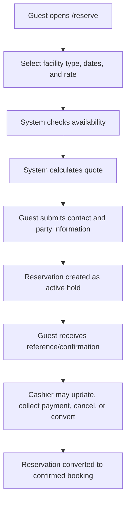
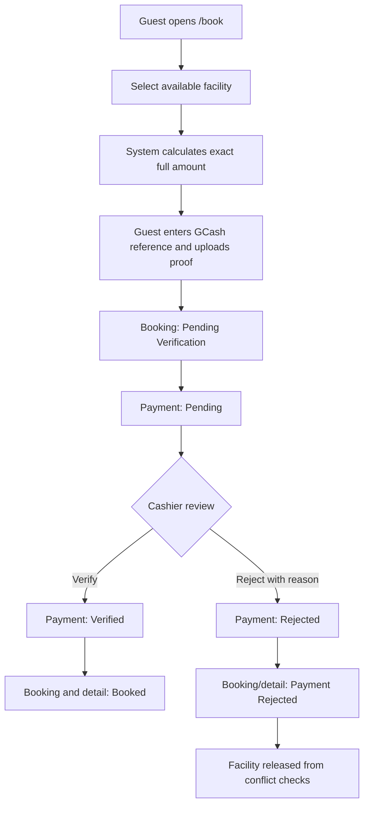
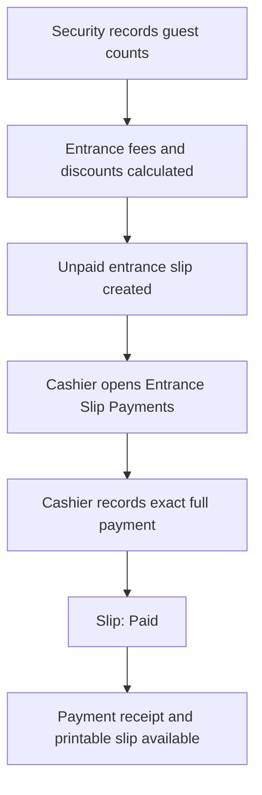
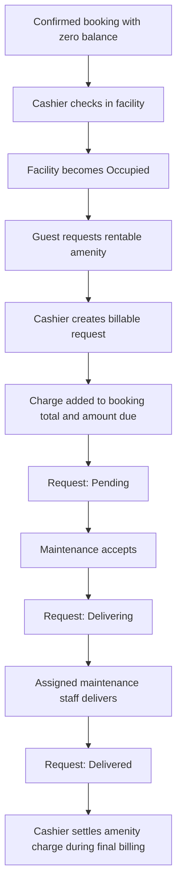
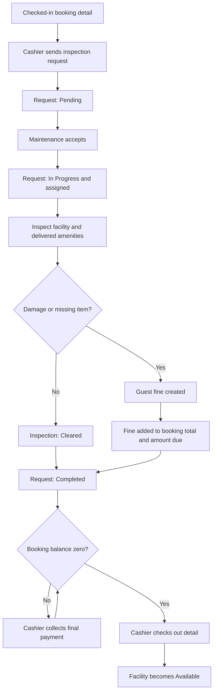

# Web-Based Booking Management with Billing System for Olaer Spring Resort

A Laravel-based resort operations system covering public reservations, confirmed bookings, GCash verification, entrance slips, check-in, amenity requests, maintenance inspections, fines, billing, checkout, reporting, notifications, and activity logging.

> **Reviewer note**
>
> This repository is being shared for code and workflow review. Reviewers are not expected to modify the implementation. The fastest review path is:
>
> 1. Read **System Scope and Business Rules**.
> 2. Read `routes/web.php`.
> 3. Trace the service classes listed under **Recommended Code Review Order**.
> 4. Run the automated tests.
> 5. Use the seeded role accounts to inspect each operational dashboard.

---

## Table of Contents

- [Project Summary](#project-summary)
- [Current Technical Stack](#current-technical-stack)
- [System Scope](#system-scope)
- [Explicitly Out of Scope](#explicitly-out-of-scope)
- [Core Business Rules](#core-business-rules)
- [Roles and Access](#roles-and-access)
- [End-to-End Operational Flows](#end-to-end-operational-flows)
- [Status Lifecycles](#status-lifecycles)
- [Architecture](#architecture)
- [Repository Map](#repository-map)
- [Recommended Code Review Order](#recommended-code-review-order)
- [Local Review Setup](#local-review-setup)
- [Seeded Review Accounts](#seeded-review-accounts)
- [Testing](#testing)
- [Important Implementation Notes](#important-implementation-notes)
- [Review Checklist](#review-checklist)
- [Known Constraints and Review Risks](#known-constraints-and-review-risks)
- [Troubleshooting](#troubleshooting)

---

## Project Summary

**Project title:** Web-Based Booking Management with Billing System for Olaer Spring Resort

The application replaces disconnected manual processes with one role-based operational workflow. It separates:

- public guest requests;
- staff-controlled reservations and bookings;
- payment verification;
- facility occupancy;
- amenity delivery;
- maintenance inspection;
- damage and fine billing;
- checkout; and
- management reporting.

The project is designed around actual resort operations rather than generic hotel assumptions. A reservation is not automatically a guaranteed booking. A facility cannot be checked out until maintenance has completed the required inspection and all charges have been settled.

---

## Current Technical Stack

### Backend

- PHP 8.3+
- Laravel 13
- Eloquent ORM
- Laravel Fortify for staff authentication and password reset
- PHPUnit 12
- MySQL as the intended application database
- SQLite in-memory database for the automated test suite

### Frontend

- Livewire
- Livewire Volt
- **Class-based Volt single-file components**
- Tailwind CSS 4
- Alpine.js through Livewire
- Flux UI components
- Vite 8

### Project conventions

- Volt components use class-based syntax:

```php
use Livewire\Volt\Component;

new class extends Component
{
    // State, computed properties, and actions
};
```

- Functional/closure-style Volt components are not part of the project convention.
- The interface uses the free Flux component set only.
- Business rules should live in service classes rather than being duplicated across pages.
- Database mutations that affect balances, status transitions, availability, or assignments should use transactions.
- Critical concurrent operations use row locking through `lockForUpdate()`.

---

## System Scope

### Public guest functions

- View the public resort homepage.
- Search available facilities.
- Create a reservation.
- Submit a direct online booking with exact full GCash payment.
- Upload GCash proof of payment.
- Manage an existing reservation using reference and OTP verification.
- Look up reservation, booking, or payment confirmation information.
- Receive confirmation emails where mail delivery is configured.

### Admin and Manager functions

- View role-specific dashboards.
- Maintain entrance fees.
- Maintain discounts.
- Maintain facilities and facility prices.
- Maintain rentable and inclusive amenities.
- Maintain fine definitions.
- Create, edit, activate, and deactivate staff accounts.
- View reports.
- View activity logs.

### Cashier functions

- Receive and collect payment for entrance slips created by Security.
- Manage reservations.
- Convert eligible reservations to bookings.
- Manage bookings.
- Review and verify or reject guest GCash submissions.
- Record verified payments.
- Process check-in.
- Create billable amenity requests.
- View billing statements.
- Send facility inspection requests at checkout.
- Record final settlement.
- Complete checkout after inspection and payment requirements are satisfied.
- View cashier reports, notifications, and action-center items.

### Maintenance functions

- Accept pending amenity delivery requests without requiring advance payment.
- Deliver requested amenities.
- Accept cashier-created inspection requests.
- Inspect inclusive facility amenities.
- Inspect delivered requested amenities.
- Mark a facility as cleared or record damage/missing-item fines.
- View maintenance notifications and action-center items.

### Security Guard functions

- Record entrance counts.
- Record adult, child, and Senior Citizen/PWD categories.
- Record male, female, and tourist counts.
- Apply valid entrance-fee discounts where applicable.
- Create printable entrance slips.
- Send the unpaid slip into the Cashier payment workflow.

---

## Explicitly Out of Scope

The following are intentionally not implemented as core project features:

- Third-party travel or OTA integration.
- Automated GCash API verification.
- Refund processing.
- Refund processing or cancellation after an amenity has been delivered or settled.
- Full warehouse-style amenity inventory.
- Guest self-service modification of confirmed bookings.
- Public staff registration.
- Self-service staff profile deletion.
- Passkeys.
- Two-factor authentication.
- Flux Pro components.

Staff accounts are created and managed by Admin or Manager. GCash proof is manually verified by a Cashier.

---

## Core Business Rules

### Reservation versus booking

A **reservation** is a temporary facility hold. It may be active without payment.

A **booking** is a guaranteed transaction. The system treats it as confirmed after full payment has been accepted or after a submitted GCash payment has been verified.

```text
Reservation = temporary hold
Booking     = guaranteed after full payment
```

### Guest capacity and room extra guests

The project distinguishes total headcount from paid room extras:

```text
total_guest_count
= complete party size, including the primary guest

no_of_extra_guests
= paid room extra guests only
```

#### Rooms

- Base occupancy: 4 guests.
- Facility capacity is the absolute maximum.
- Guests above 4 are paid extra guests.
- Paid extra count is `max(total guests - 4, 0)`.
- Named paid-extra-guest rows must match the computed paid-extra count.

#### Cottages and function halls

- Total headcount must not exceed facility capacity.
- No paid room-extra surcharge is applied.
- `no_of_extra_guests` should be 0 for this rule.

### Facility availability

Availability is date-range based. A facility is unavailable when an active reservation or booking detail overlaps the requested date interval.

The overlap rule is conceptually:

```text
existing check-in < requested check-out
AND
existing check-out > requested check-in
```

Cancelled, converted, rejected, transferred, and completed records are excluded where appropriate.

`facility_status` is operationally important, but it is not the only source of booking availability.

### Payment

Supported payment modes are Cash and GCash.

- Cashier-recorded GCash requires a reference number.
- Public online booking requires exact full GCash payment.
- Public GCash payment begins as `Pending`.
- The booking begins as `Pending Verification`.
- Cashier verification changes payment to `Verified`.
- A fully paid verified booking becomes `Booked`.
- Rejection changes the payment to `Rejected` and the booking to `Payment Rejected`.
- Entrance slips must be paid in full.
- Overpayment is rejected.
- No refund workflow is included.

### Check-in

A booking detail can be checked in only when:

- the detail is in an eligible booked state;
- the booking is not cancelled or checked out;
- the booking balance is zero;
- the facility exists and is not unavailable; and
- the checkout date has not passed.

Successful check-in:

- marks the booking detail `Checked-in`;
- marks the facility `Occupied`; and
- updates the booking to `Checked-in` or `Partially Checked-in`.

### Amenity request

Amenities can only be requested for a checked-in booking and must be assigned to a checked-in facility belonging to that booking.

```text
Cashier creates request
→ charge added to booking total and amount due
→ Pending
→ Maintenance accepts
→ Delivering
→ assigned staff delivers
→ Delivered
→ charge is settled during checkout or final billing
```

Only rentable amenities with a valid positive price can be requested.

A pending request may be edited or cancelled before Maintenance accepts it. Delivery does not require advance payment. Once assigned, delivering, or delivered, cancellation is blocked because refund processing is out of scope.

### Inspection and fines

Inspection is initiated by Cashier during checkout. Maintenance does not create arbitrary inspection work.

```text
Cashier sends inspection request
→ Pending
→ Maintenance accepts
→ In Progress
→ assigned maintenance staff inspects
→ Completed
```

Rules:

- only a Cashier may send an inspection request;
- only Maintenance Staff may accept it;
- an active assignment cannot be stolen by another maintenance account;
- only the assigned staff member may complete the inspection;
- delivered requested amenities appear in the inspection checklist;
- recorded fines increase both `booking.total_price` and `booking.amount_due`;
- a facility with recorded fines cannot later be marked as “no damage.”

### Checkout

A booking detail may be checked out only when:

- it is currently `Checked-in`;
- a completed inspection request with an inspection record exists; and
- the booking balance is zero.

Successful checkout:

- marks the booking detail `Checked-out`;
- marks the facility `Available`; and
- updates the booking to `Checked-out` or `Partially Checked-out`.

### Master data

Master records already referenced by transactions should not be physically deleted. Update or deactivate them instead.

This protects historical bookings, prices, discounts, fines, and reports.

---

## Roles and Access

| Role | Primary responsibilities | Route prefix |
|---|---|---|
| Admin | Master data, users, reports, activity logs, dashboards | `/admin` |
| Manager | Same review/management area as Admin | `/admin` |
| Cashier | Reservations, bookings, payments, billing, check-in, checkout, GCash verification | `/cashier` |
| Maintenance Staff | Amenity delivery and facility inspection | `/maintenance` |
| Security Guard | Entrance-slip creation | `/security` |
| Guest | Public reservation, direct booking, reservation management, confirmation lookup | public routes |

Route access is enforced through:

```text
auth
active
role:<allowed roles>
```

An inactive staff account is logged out and redirected to Login. Unauthorized roles receive HTTP 403.

---

## End-to-End Operational Flows

### 1. Public reservation flow



Review starting points:

```text
resources/views/livewire/guest/reservations/create.blade.php
app/Services/PublicReservationWorkflowService.php
app/Services/PublicFacilitySearchService.php
app/Services/ReservationQuoteService.php
app/Services/ReservationToBookingWorkflowService.php
```

### 2. Public GCash booking flow



Review starting points:

```text
resources/views/livewire/guest/bookings/create.blade.php
app/Services/PublicBookingWorkflowService.php
app/Services/BookingAvailabilityService.php
app/Services/BookingQuoteService.php
resources/views/livewire/cashier/gcash-verifications/index.blade.php
app/Services/GcashPaymentVerificationService.php
```

### 3. Entrance-slip flow



Review starting points:

```text
resources/views/livewire/security/entrance-slips/create.blade.php
resources/views/livewire/cashier/entrance-slips/index.blade.php
app/Services/EntranceSlipCalculator.php
app/Services/PaymentWorkflowService.php
```

### 4. Check-in to amenity delivery



Review starting points:

```text
resources/views/livewire/cashier/check-ins/index.blade.php
app/Services/CheckInWorkflowService.php
resources/views/livewire/cashier/amenity-requests/index.blade.php
resources/views/livewire/maintenance/amenity-requests/index.blade.php
app/Services/AmenityRequestWorkflowService.php
app/Services/PaymentWorkflowService.php
```

### 5. Inspection, fine settlement, and checkout



Review starting points:

```text
resources/views/livewire/cashier/check-outs/index.blade.php
resources/views/livewire/maintenance/facility-inspections/index.blade.php
app/Services/CheckOutInspectionRequestService.php
app/Services/FacilityInspectionWorkflowService.php
app/Services/CheckOutWorkflowService.php
app/Services/PaymentWorkflowService.php
```

---

## Status Lifecycles

### Reservation

```text
Active
├── Paid
├── Converted
├── Cancelled
└── No-show
```

### Public GCash payment

```text
Pending
├── Verified
└── Rejected
```

### Booking

```text
Pending Verification
├── Booked
│   ├── Partially Checked-in
│   ├── Checked-in
│   ├── Partially Checked-out
│   └── Checked-out
└── Payment Rejected
```

Other operational states may include:

```text
Cancelled
Rescheduled
Transferred
Extended
```

### Amenity request

```text
Pending
├── Cancelled
└── Delivering
    └── Delivered
```

### Inspection request

```text
Pending
└── In Progress
    └── Completed
```

### Facility

```text
Available
Occupied
Unavailable
```

Facility availability for a requested date also depends on overlapping reservation and booking records.

---

## Architecture

### Request and component layer

Routes are declared in:

```text
routes/web.php
```

Most interactive pages are Volt single-file components under:

```text
resources/views/livewire/
```

Public pages use `layouts.public`. Authenticated staff pages use `layouts.app`.

### Service layer

Workflow and pricing rules are concentrated under:

```text
app/Services/
```

Services are the primary review target for transactional integrity and business correctness.

Typical call direction:

```text
Route
→ Volt component
→ workflow/search/quote service
→ Eloquent models
→ database
```

Volt components generally handle:

- state;
- input validation;
- filters and pagination;
- user feedback; and
- calling the relevant service.

Services generally handle:

- business-rule guards;
- transaction boundaries;
- row locking;
- status transitions;
- financial adjustments;
- availability logic; and
- role-sensitive operations.

### Model layer

Models are under `app/Models/`.

The schema uses custom table and primary-key names:

```text
tbl_booking.booking_id
tbl_booking_details.booking_details_id
tbl_reservation.reservation_id
tbl_payment.payment_id
```

Do not assume Laravel’s default `id` primary key or plural table names while reviewing relationships.

### Middleware

Important middleware:

```text
app/Http/Middleware/EnsureUserIsActive.php
app/Http/Middleware/EnsureUserHasRole.php
app/Http/Middleware/UpdateUserLastSeen.php
```

### Persistence and files

- Database migrations: `database/migrations/`
- Seeders: `database/seeders/`
- GCash proof uploads: `storage/app/public/gcash-proofs/`
- Public storage link: `public/storage`
- Printable documents: `app/Http/Controllers/PrintDocumentController.php`
- Print layout: `resources/views/components/print/layout.blade.php`

### Tests

```text
tests/Unit/
tests/Feature/
phpunit.xml
```

The test environment uses an in-memory SQLite database and does not alter the development MySQL database.

---

## Repository Map

```text
app/
├── Actions/Fortify/             Staff password-reset actions
├── Http/
│   ├── Controllers/             Printable document controller
│   └── Middleware/              Active-account and role enforcement
├── Models/                      Eloquent domain models
├── Observers/                   Activity-log observers
├── Providers/                   Fortify and application configuration
└── Services/                    Business rules and workflow orchestration

database/
├── factories/                   Test factories
├── migrations/                  Schema
└── seeders/                     Roles, payment modes, fees, facilities, users

resources/views/
├── components/                  Reusable UI and print components
├── layouts/                     Public, authenticated, and auth layouts
├── livewire/
│   ├── admin/
│   ├── cashier/
│   ├── guest/
│   ├── maintenance/
│   └── security/
└── pages/auth/                  Fortify authentication screens

routes/
└── web.php                      Public and role-specific route map

tests/
├── Feature/                     Workflow, rendering, pagination, and auth tests
└── Unit/                        Isolated domain-rule tests
```

---

## Recommended Code Review Order

This sequence minimizes context switching.

### Pass 1 — Scope and access

1. `README.md`
2. `routes/web.php`
3. `app/Http/Middleware/EnsureUserIsActive.php`
4. `app/Http/Middleware/EnsureUserHasRole.php`
5. `app/Models/User.php`
6. `app/Models/Role.php`

Confirm every staff route has `auth`, `active`, and the correct role, and that public routes do not expose staff actions.

### Pass 2 — Core data model

Review these models and their matching migrations:

```text
Guest
Address
Facility
FacilityType
FacilityPrice
Reservation
ReservationDetail
ReservationExtraGuest
Booking
BookingDetail
BookingExtraGuest
Payment
ModeOfPayment
EntranceSlip
EntranceSlipDetail
Amenity
AmenityName
AmenityRequest
AmenityRequestDetail
Fine
GuestFine
FacilityInspectionRequest
FacilityInspection
FacilityInspectionItem
Discount
ActivityLog
```

Confirm:

- foreign keys and relation key names match the custom schema;
- `booking_details_id` is used consistently;
- decimal financial columns have appropriate precision;
- status fields accept all values used by services; and
- indexes exist for availability and operational filters.

### Pass 3 — Availability, pricing, and capacity

Review:

```text
app/Services/BookingAvailabilityService.php
app/Services/PublicFacilitySearchService.php
app/Services/PublicBookingSearchService.php
app/Services/ReservationQuoteService.php
app/Services/BookingQuoteService.php
app/Services/FacilityOccupancyService.php
```

Confirm date overlap logic, room base occupancy, capacity limits, extra charges, discount eligibility, and historical line totals.

### Pass 4 — Public transactions

Review:

```text
resources/views/livewire/guest/reservations/create.blade.php
app/Services/PublicReservationWorkflowService.php
resources/views/livewire/guest/bookings/create.blade.php
app/Services/PublicBookingWorkflowService.php
resources/views/livewire/guest/reservations/manage.blade.php
resources/views/livewire/guest/confirmations/lookup.blade.php
```

Confirm validation and service rules agree, proof uploads are restricted, availability is rechecked in the transaction, references are unique, and OTP lookup does not expose unrelated data.

### Pass 5 — Cashier transaction chain

Review in this order:

```text
app/Services/GcashPaymentVerificationService.php
app/Services/ReservationToBookingWorkflowService.php
app/Services/PaymentWorkflowService.php
app/Services/CheckInWorkflowService.php
app/Services/AmenityRequestWorkflowService.php
app/Services/CheckOutInspectionRequestService.php
app/Services/CheckOutWorkflowService.php
```

Confirm payments cannot exceed balances, rejected GCash releases availability, conversion cannot duplicate bookings, unpaid check-in is blocked, paid amenities are released, and checkout requires inspection plus zero balance.

### Pass 6 — Maintenance chain

Review:

```text
app/Services/AmenityRequestWorkflowService.php
app/Services/FacilityInspectionWorkflowService.php
app/Services/CheckOutInspectionRequestService.php
```

Confirm assignments cannot be stolen, only assigned staff can deliver or inspect, delivered amenities are included, contradictory no-damage/fine results are blocked, and fine totals update atomically.

### Pass 7 — Reporting, printing, and audit

Review:

```text
app/Services/BillingStatementService.php
app/Services/ReportsService.php
app/Http/Controllers/PrintDocumentController.php
app/Models/ActivityLog.php
app/Observers/
resources/views/livewire/admin/activity-logs/index.blade.php
```

Confirm reports use authoritative transaction values, print routes enforce access, sensitive values are not logged, and critical bulk updates are audited where required.

### Pass 8 — Tests

Run and read:

```text
tests/Unit/FacilityOccupancyServiceTest.php
tests/Feature/CoreWorkflowGuardTest.php
tests/Feature/*PaginationTest.php
tests/Feature/*RenderTest.php
tests/Feature/Auth/
```

The two most important business-rule suites are:

```bash
php artisan test --filter=FacilityOccupancyServiceTest
php artisan test --filter=CoreWorkflowGuardTest
```

---

## Local Review Setup

### Requirements

- PHP 8.3 or newer
- Composer 2
- Node.js and npm compatible with the installed Vite version
- MySQL for a full application review
- Git
- PHP extensions required by Laravel, including PDO, Mbstring, OpenSSL, Tokenizer, XML, Ctype, JSON, and Fileinfo

### 1. Clone and install

```bash
git clone <repository-url>
cd olaer-booking-management
composer install
npm install
```

### 2. Create the environment file

```bash
cp .env.example .env
php artisan key:generate
```

For Windows Command Prompt:

```bat
copy .env.example .env
php artisan key:generate
```

### 3. Configure an isolated review database

Do not point the application at a shared or production database.

```dotenv
APP_NAME="Olaer Spring Resort"
APP_ENV=local
APP_DEBUG=true
APP_URL=http://127.0.0.1:8000

DB_CONNECTION=mysql
DB_HOST=127.0.0.1
DB_PORT=3306
DB_DATABASE=olaer_review
DB_USERNAME=root
DB_PASSWORD=

MAIL_MAILER=log
QUEUE_CONNECTION=database
SESSION_DRIVER=database
CACHE_STORE=database
```

### 4. Build and seed the review database

```bash
php artisan migrate --seed
```

The primary seeder loads roles, payment modes, entrance fees, facility types, amenities, fines, facilities, and demo users.

For a disposable review database only:

```bash
php artisan migrate:fresh --seed
```

> Never run `migrate:fresh` against a database containing required data.

### 5. Create the public storage link

```bash
php artisan storage:link
```

### 6. Build frontend assets

```bash
npm run build
```

Interactive frontend build:

```bash
npm run dev
```

### 7. Run the application

Simple mode:

```bash
php artisan serve
```

Open:

```text
http://127.0.0.1:8000
```

Full development mode:

```bash
composer run dev
```

That command starts the Laravel server, queue listener, and Vite process together.

### 8. Clear stale caches after configuration or view changes

```bash
php artisan optimize:clear
php artisan view:clear
php artisan config:clear
```

---

## Seeded Review Accounts

All seeded accounts use:

```text
Password: password
```

| Role | Email | Username |
|---|---|---|
| Admin | `admin@olaer.test` | `admin` |
| Manager | `manager@olaer.test` | `manager` |
| Cashier | `cashier@olaer.test` | `cashier` |
| Maintenance Staff | `maintenance@olaer.test` | `maintenance` |
| Security Guard | `security@olaer.test` | `security` |

Authentication is configured to use **email** as the login field.

These credentials are for local review data only and must not be used in production.

---

## Testing

### Run the complete test suite

```bash
php artisan test
```

The latest local review run completed with zero failures.

Some starter-kit tests are intentionally skipped because these features are outside the approved scope:

- public registration;
- email verification;
- two-factor authentication;
- passkeys;
- self-service profile editing; and
- self-service account deletion.

A skipped out-of-scope test is not a failed resort workflow.

### Run the critical business-rule tests

```bash
php artisan test --filter=FacilityOccupancyServiceTest
php artisan test --filter=CoreWorkflowGuardTest
```

These validate capacity, paid room extras, unpaid check-in blocking, facility occupancy, cashier-only inspection requests, assignment ownership, inspection requirements, zero-balance checkout, and facility release.

### Test database

`phpunit.xml` configures:

```text
DB_CONNECTION=sqlite
DB_DATABASE=:memory:
```

Tests do not use the configured development MySQL database.

### Optional static checks

```bash
composer run lint:check
composer run types:check
```

The full Composer check is:

```bash
composer run test
```

It runs Pint, PHPStan, and PHPUnit.

---

## Important Implementation Notes

### Custom database naming

The project does not use Laravel’s default table naming.

```text
Model: Booking
Table: tbl_booking
Primary key: booking_id

Model: BookingDetail
Table: tbl_booking_details
Primary key: booking_details_id
```

When reviewing relationships, verify the custom foreign and owner keys.

### Financial values

Transaction tables store snapshot values such as:

```text
base_price
discount_amount
extra_guest_fee
line_total
total_price
amount_due
unit_price
total_charge
```

A later master-price change should affect new transactions, not rewrite historical totals.

### Multi-facility bookings

Check-in, inspection, and checkout operate at the `BookingDetail` level.

Do not assume a booking has only one facility. Parent status summarizes the child details:

```text
Partially Checked-in
Checked-in
Partially Checked-out
Checked-out
```

### Row locking and transactions

High-risk areas should use transactions and row locks:

- availability checks;
- reservation conversion;
- payment posting;
- GCash verification;
- check-in;
- maintenance assignment;
- fine recording; and
- checkout.

### Activity logging

Eloquent observers do not run for direct query-builder bulk updates.

```php
Model::query()->where(...)->update([...]);
DB::table(...)->where(...)->update([...]);
```

Such operations require separate review when complete auditing is expected.

### GCash proof storage

The public booking form stores proof files under:

```text
storage/app/public/gcash-proofs
```

Accepted types:

```text
jpg
jpeg
png
pdf
```

Current maximum upload size:

```text
4096 KB
```

### Mail

The example environment uses `MAIL_MAILER=log`. Confirmation and reset messages are therefore written to:

```text
storage/logs/laravel.log
```

### Operational history

Facilities, amenities, fines, discounts, rates, and staff records may be referenced by historical transactions. The expected administrative pattern is:

```text
edit
activate/deactivate
mark available/unavailable
```

rather than deleting linked records.

---

## Review Checklist

### Access control

- [ ] Public routes expose no staff mutation actions.
- [ ] Every staff route has the correct middleware.
- [ ] Inactive users cannot continue using a session.
- [ ] Admin/Manager permissions are intentional.
- [ ] Maintenance cannot access Cashier-only pages.

### Reservation and booking

- [ ] Availability is rechecked during database mutation.
- [ ] Overlapping active records are blocked.
- [ ] Reservation conversion cannot run twice.
- [ ] Discount snapshots survive reservation changes and conversion.
- [ ] GCash rejection removes the booking from availability conflicts.
- [ ] Full payment is required before a booking becomes guaranteed.

### Capacity

- [ ] `total_guest_count` includes the primary guest.
- [ ] Room base occupancy is 4.
- [ ] Room paid extras equal guests above 4.
- [ ] Total guests never exceed facility capacity.
- [ ] Cottages and function halls do not receive room-extra fees.
- [ ] Named paid-extra rows match the computed paid-extra count.

### Payments and billing

- [ ] Payment amount is greater than zero.
- [ ] Overpayment is blocked.
- [ ] Entrance slips require exact full payment.
- [ ] GCash requires a reference number.
- [ ] Amount due is updated atomically.
- [ ] Amenity and fine charges appear in billing.
- [ ] Historical values are not recalculated from current prices.

### Check-in and checkout

- [ ] Unpaid bookings cannot check in.
- [ ] Check-in marks the specific facility occupied.
- [ ] Cashier creates the inspection request.
- [ ] Inspection assignment cannot be taken over.
- [ ] Only assigned Maintenance Staff can complete it.
- [ ] Checkout requires a completed inspection.
- [ ] Checkout requires zero balance.
- [ ] Checkout marks only the relevant facility available.
- [ ] Parent booking status correctly summarizes all details.

### Amenity and fine workflow

- [ ] Amenities can only be requested for checked-in bookings.
- [ ] Delivery facility belongs to that booking.
- [ ] Only rentable amenities can be billed.
- [ ] Request remains unavailable to Maintenance until paid.
- [ ] Only assigned Maintenance Staff can mark delivery.
- [ ] Delivered amenities appear in the inspection checklist.
- [ ] Fine amounts update both total and amount due.
- [ ] A fined facility cannot be marked no damage.

### Files and security

- [ ] Upload MIME and size validation are enforced.
- [ ] GCash proofs cannot be accessed through arbitrary paths.
- [ ] Print endpoints enforce role access.
- [ ] Password-reset behavior is rate-limited appropriately.
- [ ] OTP values expire and cannot be reused.
- [ ] Sensitive values are excluded from activity logs.
- [ ] Production uses `APP_DEBUG=false`.

### Tests

- [ ] `php artisan test` finishes with zero failures.
- [ ] Capacity tests pass.
- [ ] Core workflow guard tests pass.
- [ ] Pagination tests pass.
- [ ] Render tests pass.
- [ ] Skipped tests correspond only to documented out-of-scope features.

---

## Known Constraints and Review Risks

### 1. Concurrency under MySQL traffic

Verify that every availability check and subsequent write occurs within a safe transaction boundary.

### 2. Database indexes

Review indexes for:

```text
facility_id
booking_id
reservation_id
status
check_in_date
check_out_date
payment_status
amenity_request_status
booking_details_id
```

### 3. Audit coverage of bulk updates

Direct query-builder updates bypass Eloquent observers. Critical transitions may require explicit audit records.

### 4. Public payment-proof storage

The current workflow uses the public storage disk. A production security review should decide whether proofs should use private storage with an authorized download controller.

### 5. Environment defaults

`.env.example` is a Laravel-oriented baseline and may still contain generic values such as:

```dotenv
APP_NAME=Laravel
DB_CONNECTION=sqlite
MAIL_FROM_ADDRESS=hello@example.com
```

Reviewers should use an isolated environment rather than treating those values as production configuration.

### 6. Test skips

Disabled starter-kit features are documented and intentionally skipped. Do not re-enable them without designing the required columns, views, policies, and ownership rules.

---

## Troubleshooting

### `Route [...] not defined`

```bash
php artisan optimize:clear
php artisan route:list
```

### Views still show an older component

```bash
php artisan view:clear
php artisan optimize:clear
```

### GCash proof link is unavailable

```bash
php artisan storage:link
```

Confirm that the file exists under `storage/app/public/gcash-proofs`.

### Database session, cache, or queue table errors

```bash
php artisan migrate
```

### Seeded login does not work

On an isolated disposable review database:

```bash
php artisan migrate:fresh --seed
```

Then log in with a seeded email and password `password`.

### Tests report nonexistent user columns

Confirm the custom factory is present:

```text
database/factories/UserFactory.php
```

It must use `tbl_user` fields and must not insert disabled two-factor columns unless those columns exist.

### Tests pass individually but not as a full suite

```bash
php artisan optimize:clear
php artisan config:clear
php artisan view:clear
php artisan test
```

---

## Final Review Principle

Evaluate the application as a connected resort workflow, not as unrelated CRUD pages.

```text
Availability
→ Reservation or paid booking
→ Payment verification
→ Check-in
→ Amenity requests and payment
→ Maintenance inspection
→ Fine settlement
→ Checkout
→ Reporting and audit
```

A change is correct only when it preserves the entire chain, including balances, status transitions, facility availability, role ownership, historical transaction values, and multi-facility booking behavior.
